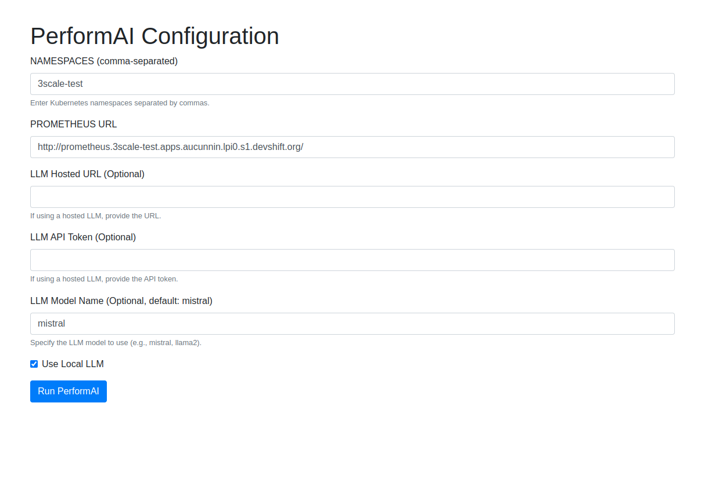

# PerformAI

**PerformAI** is a modular Python tool that connects to a Kubernetes cluster, analyzes CPU and memory usage of workloads using Prometheus metrics, and generates optimization recommendations using a local LLM (like Mistral 7B via Ollama) or hosted LLMs compatible with OpenAI API.

---

## 🚀 Features
- Targets only specific namespaces
- Pulls resource usage from Prometheus over configured lookback duration
- Compares with actual CPU/Memory requests & limits
- Uses local or hosted LLM compatible with OpenAI API to get recommended adjustments

---

## 📦 Requirements
- Python 3.9+
- Prometheus endpoint accessible (you can follow [Prometheus Setup](#prometheus-setup-optional) to setup prometheus via Jupyter Notebook)
- `kubectl` and `oc` configured and authenticated
- [Ollama](https://ollama.com/) running locally with the `mistral` model:
  ```bash
  ollama run mistral
  ```
- Optionally, hosted LLM URL, Model name, API Token

---

## 🔧 Setup
```bash
git clone https://github.com/yourusername/performAI.git
cd performAI
python3 -m venv venv
source venv/bin/activate
pip install -r requirements.txt
```

---

## 🛠 Configuration
Set the environment variables 
```commandline
export NAMESPACES="namespace1,namespace2,another-namespace"
export PROMETHEUS_URL="https://your-prometheus.example.com"
export LOOKBACK_DURATION="7d"
export CHUNK_SIZE="10"
export DEBUG="True"
```

---

## 🧠 Usage

For local LLM: 
```bash
python main.py
```
For hosted LLM:
```bash
USE_LOCAL_LLM=false \
LLM_HOSTED_URL=https://your-llm-host.com \
LLM_API_TOKEN=your-token-here \
LLM_MODEL=model-name \
python main.py
```
For web UI
```bash
python app.py
```
served on localhost:5000




## ⚙️ Prometheus Setup (Optional)
If your cluster does not yet have Prometheus installed or configured, you can use the interactive Jupyter notebook provided to set it up:

```bash
python3 -m venv venv-setup
source venv-setup/bin/activate
pip install notebook
jupyter notebook setup/prometheus-setup.ipynb
```

The notebook will:
- Detect your current namespace and OpenShift domain
- Install Prometheus Operator on current namespace
- Create the necessary RBAC and scrape configurations
- Deploy Prometheus CR
- Provide an external route to access Prometheus UI

> Note: You need `oc` and sufficient cluster permissions to run this notebook on OpenShift.


---

## 🌐 Available Environment Variables

| Variable           | Description                                              | Default          |
|--------------------|----------------------------------------------------------|------------------|
| `NAMESPACES`       | Comma-separated list of Kubernetes namespaces to monitor.| `threescale`     |
| `PROMETHEUS_URL`   | URL of the Prometheus instance to query.                 | ``               |
| `LOOKBACK_DURATION`| The time window to query Prometheus for metrics.         | `30d`            |
| `CHUNK_SIZE`       | The size of workload chunks sent to the LLM for analysis.| `5`              |
| `DEBUG`            | Enable debug logging (set to "true" for verbose output). | `false`          |
| `USE_LOCAL_LLM`    | Whether to use local Ollama (`true` or `false`)          | `true`           |
| `LLM_HOSTED_URL`   | Base URL of the hosted LLM endpoint                      | *(required if hosted)* |
| `LLM_API_TOKEN`    | API token to authenticate with hosted LLM                | *(required if hosted)* |
| `LLM_MODEL`        | Model name to use (e.g., `mistral`, `gpt-3.5-turbo`)     | `mistral`        |

These environment variables control which LLM is used and how it's accessed. When using a hosted LLM, ensure the URL and token are valid for the OpenAI-compatible `/v1/chat/completions` endpoint.

---

## 📂 Project Structure
```
performai/
├── config.py
├── collect.py
├── prompts.py
├── llm.py
├── utils.py  
templates/
├── index.html
├── processing.html
├── results.html     
app.py
main.py
setup/
└── prometheus_setup.ipynb
```

---

## 📜 License
MIT
